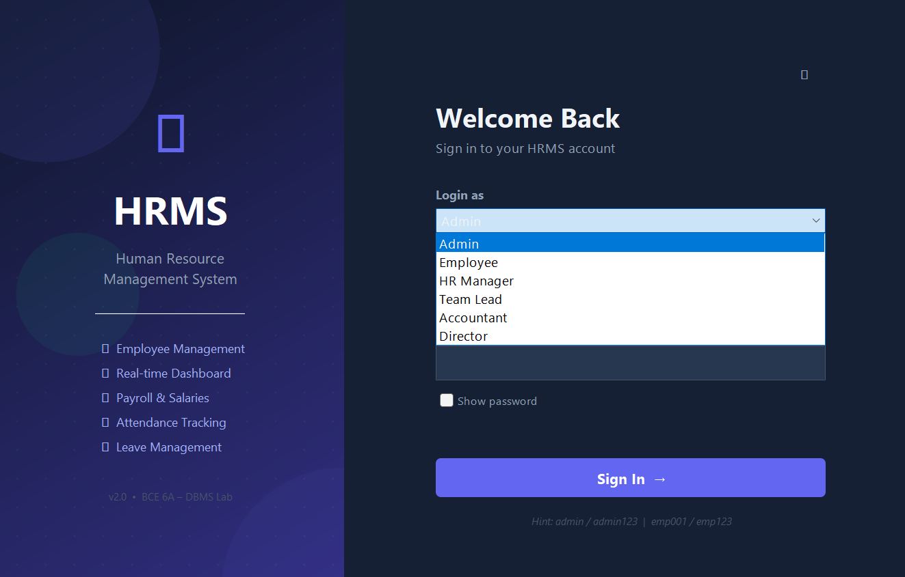
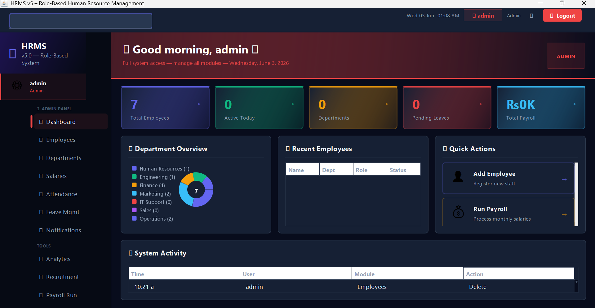
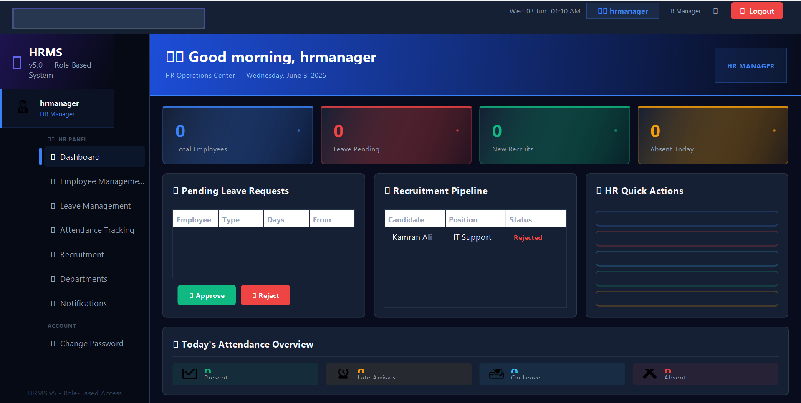
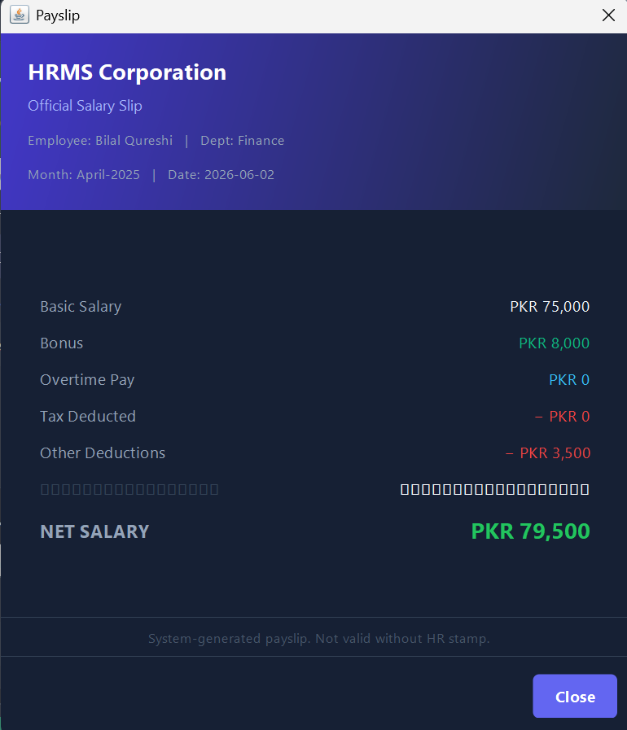
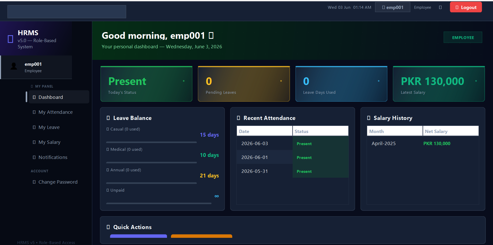
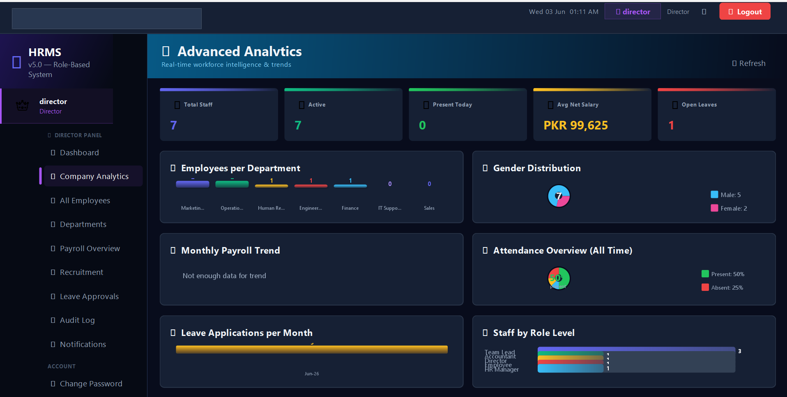

# HRMS v5 — Role-Based Human Resource Management System

> A professional desktop HR application built with **Java Swing**, **JDBC**, and **SQL Server**.  
> Features **6 distinct role-based dashboards**, each color-coded and showing only what that role needs.

---

## Screenshots









---

## Roles & Dashboards

| Role | Color | Sidebar Panels |
|------|-------|----------------|
| **Admin** | 🔴 Red | Dashboard · Employees · Departments · Salaries · Attendance · Leave · Notifications · Analytics · Recruitment · Payroll Run · Audit Log |
| **Director** | 🟣 Purple | Dashboard · Company Analytics · All Employees · Departments · Payroll Overview · Recruitment · Leave Approvals · Audit Log · Notifications |
| **HR Manager** | 🔵 Blue | Dashboard · Employee Management · Leave Management · Attendance Tracking · Recruitment · Departments · Notifications |
| **Team Lead** | 🟢 Green | Dashboard · My Team · Team Attendance · Team Leave Requests · Recruitment · Notifications |
| **Accountant** | 🟡 Yellow | Dashboard · Salary Management · Payroll Run · Financial Reports · Expense Tracking · Notifications |
| **Employee** | ⚪ Gray | Dashboard · My Attendance · My Leave · My Salary · Notifications |

---

## Default Login Credentials

> ⚠️ For local development only. Passwords are stored as **SHA-256 hashes** in the database.

| Username | Password | Role |
|----------|----------|------|
| `admin` | `admin123` | Admin |
| `director` | `dir123` | Director |
| `hrmanager` | `hr123` | HR Manager |
| `teamlead` | `tl123` | Team Lead |
| `accountant` | `ac123` | Accountant |
| `employee1` | `emp123` | Employee |

---

## Features

| Module | What it does |
|--------|-------------|
| **Authentication** | Split-screen login, role selector, SHA-256 passwords, SwingWorker async auth |
| **Connection Dialog** | GUI to configure SQL Server host/db/user/pass at startup — no recompile needed |
| **6 Role Dashboards** | Each role sees a tailored dashboard with relevant KPIs and action cards |
| **Employee Management** | Full CRUD, photo upload, profile dialog, CNIC, contract type, overtime/tax fields |
| **Salary & Payroll** | Salary records with basic/bonus/overtime/tax/deductions, computed Net Salary, payroll run dialog, CSV export |
| **Attendance** | Mark daily attendance per employee with status (Present/Absent/Leave/Half-Day) |
| **Leave Management** | Apply, approve/reject leave with balance tracking per employee |
| **Department Management** | Add/edit/delete departments, assign manager |
| **Recruitment Pipeline** | Candidate tracking: Applied → Shortlisted → Interview → Hired/Rejected |
| **Expense Tracking** | Accountant-facing expense log by category (Payroll/Bonuses/Overtime/Utilities/etc.) |
| **Analytics Dashboard** | Charts and KPIs for headcount, salary distribution, attendance rates |
| **Notifications** | System-wide notification panel |
| **Audit Log** | Full CRUD activity trail (Admin/Director only) |
| **Global Search** | Top-bar search across employees, leave, and salary from any screen |
| **Change Password** | In-app password change dialog with current password verification |
| **CSV Export** | Export tables to `.csv` via `CsvExporter` utility |

---

## Tech Stack

| Layer | Technology |
|-------|------------|
| Language | Java 11+ |
| UI Framework | Java Swing — custom dark theme (`Theme.java`) |
| Database | Microsoft SQL Server 2019+ (Express works) |
| JDBC Driver | mssql-jdbc 13.4 (`mssql-jdbc-13.4.0.jre11.jar`) |
| Architecture | Layered: `gui` → `dao` → SQL Server |
| Security | SHA-256 password hashing, role-checked navigation |
| Utilities | `CsvExporter`, `PhotoHelper`, `SalaryCalculator`, `AuditLogger`, `DialogHelper` |

---

## Project Structure

```
src/hrms/
├── Main.java                        ← Entry point (ConnectionDialog → LoginDialog → MainWindow)
├── auth/
│   └── SessionManager.java          ← Singleton current-user holder
├── db/
│   └── DBConnection.java            ← JDBC singleton, configure() for runtime reconfiguration
├── model/                           ← POJOs: User, Employee, Salary, Attendance, LeaveApplication, Department, Candidate
├── dao/                             ← All SQL queries (PreparedStatement / CallableStatement)
│   ├── UserDAO.java
│   ├── EmployeeDAO.java             ← 277 lines, most comprehensive DAO
│   ├── SalaryDAO.java
│   ├── AttendanceDAO.java
│   ├── LeaveDAO.java
│   ├── LeaveBalanceDAO.java
│   ├── DepartmentDAO.java
│   ├── RecruitmentDAO.java
│   ├── NotificationDAO.java
│   └── AuditDAO.java (via AuditLogger.java)
├── gui/
│   ├── Theme.java                   ← 543-line design system (colors, fonts, buttons, cards, tables)
│   ├── LoginDialog.java             ← Split-screen animated login
│   ├── MainWindow.java              ← Sidebar + TopBar + CardLayout content area
│   ├── ConnectionDialog.java        ← DB config on startup
│   ├── ChangePasswordDialog.java
│   ├── AdminDashboardPanel.java
│   ├── DirectorDashboardPanel.java
│   ├── HRDashboardPanel.java
│   ├── TeamLeadDashboardPanel.java
│   ├── AccountantDashboardPanel.java
│   ├── EmployeeDashboardPanel.java
│   ├── EmployeePanel.java           ← 420 lines, full CRUD + photo
│   ├── EmployeeProfileDialog.java   ← 471 lines, complete profile view
│   ├── SalaryPanel.java             ← 418 lines
│   ├── LeavePanel.java              ← 364 lines
│   ├── AttendancePanel.java         ← 298 lines
│   ├── DepartmentPanel.java         ← 307 lines
│   ├── AnalyticsDashboard.java      ← 508 lines, charts
│   ├── RecruitmentPanel.java
│   ├── ExpenseTrackingPanel.java
│   ├── FinancialReportsPanel.java
│   ├── AuditLogPanel.java
│   ├── NotificationsPanel.java
│   ├── GlobalSearchPanel.java
│   ├── PayrollRunDialog.java
│   ├── TeamMembersPanel.java
│   └── DashboardPanel.java
└── util/
    ├── CsvExporter.java             ← Export any table to .csv
    ├── PhotoHelper.java             ← Employee photo load/resize
    ├── SalaryCalculator.java        ← Net salary formula utility
    ├── AuditLogger.java             ← Writes to AuditLog table
    └── DialogHelper.java            ← Reusable confirm/error/info dialogs

sql/
├── HRMS_Database_v2.sql             ← Base schema (Departments, Employees, Salaries, Attendance, Leave, SystemUsers)
├── HRMS_Database_v4.sql             ← Adds Gender, CNIC, Photo, Overtime, Tax, Recruitment, Notifications, AuditLog
└── HRMS_Database_v5.sql             ← Adds Expenses, TeamAssignments, updated role constraints, v5 sample data

lib/
└── mssql-jdbc-13.4.0.jre11.jar     ← Required — download from Microsoft

out/                                 ← Compiled .class files (generated by build)
```

**Total: 51 Java files · ~8,400 lines of code**

---

## Database Schema Summary

```
Departments  ──< Employees >──  SystemUsers
                    │
                    ├──< Salaries          (Basic + Bonus + OT - Tax - Deductions = Net_Salary computed)
                    ├──< Attendance        (Date, Status: Present/Absent/Leave/Half-Day)
                    ├──< LeaveApplications (Type, From, To, Status: Pending/Approved/Rejected)
                    └──< TeamAssignments   (Lead_Emp_ID → Member_Emp_ID)

Recruitment    (independent candidate pipeline)
Expenses       (Accountant-managed, by Category)
Notifications  (system messages)
AuditLog       (user, action, table, timestamp)
```

---

## Setup Guide

### Prerequisites

- JDK 11 or later (`java -version` to check)
- SQL Server 2019+ or SQL Server Express
- `mssql-jdbc-13.4.0.jre11.jar` in the `lib/` folder

### Step 1 — Get the JDBC Driver

Download from Microsoft and place in `lib/`:  
https://learn.microsoft.com/en-us/sql/connect/jdbc/download-microsoft-jdbc-driver-for-sql-server

### Step 2 — Enable SQL Server

1. Open **SQL Server Configuration Manager**
2. Enable **TCP/IP** under Protocols for SQLEXPRESS
3. Restart the SQL Server service
4. In SSMS → Server Properties → Security: enable **SQL Server and Windows Authentication mode**

### Step 3 — Run SQL Scripts (in SSMS, in this exact order)

```
1.  sql/HRMS_Database_v2.sql   ←  Base schema + sample data
2.  sql/HRMS_Database_v4.sql   ←  v4 columns + Recruitment + Notifications + AuditLog
3.  sql/HRMS_Database_v5.sql   ←  Expenses + TeamAssignments + v5 role constraints
```

### Step 4 — Build & Run

**Windows:**
```bat
build.bat
```

**Linux / macOS:**
```bash
find src -name "*.java" > sources.txt
javac -encoding UTF-8 -cp "lib/*" -sourcepath src -d out --release 11 @sources.txt
java -cp "out:lib/*" hrms.Main
```

> When the app starts, a **Connection Dialog** appears — enter your SQL Server details there. No need to edit source code.

---

## What's New in v5

- **6 fully distinct role dashboards** — each role gets its own panel with relevant KPIs and action cards
- **Role color coding** — accent color flows through the entire UI per role (sidebar, badges, cards, headers)
- **Accountant panel** — salary management, payroll run, expense tracking, financial reports
- **Director panel** — company-wide analytics, payroll distribution, approval queue
- **HR Manager panel** — leave queue, recruitment pipeline, attendance summary
- **Team Lead panel** — scoped team roster, leave recommendations, weekly attendance tiles
- **Expense Tracking** — new `Expenses` table and management panel
- **TeamAssignments** — maps Team Leads to their direct reports for scoped views
- **Enhanced Theme.java** — `pageHeader()`, `actionCard()`, `badge()`, `divider()` components added
- **HRMS_Database_v5.sql** — Expenses table, TeamAssignments, updated role CHECK constraints, sample expenses

---
How to Run This Project
What you need installed

Java JDK 11 or later → https://adoptium.net
SQL Server 2019+ or SQL Server Express (free) → https://www.microsoft.com/en-us/sql-server/sql-server-downloads
SSMS (SQL Server Management Studio) → https://aka.ms/ssmsfullsetup


Step 1 — Download the project
Click the green "Code" button on the repo → "Download ZIP" → extract it

Step 2 — Download the JDBC Driver

Go to → https://learn.microsoft.com/en-us/sql/connect/jdbc/download-microsoft-jdbc-driver-for-sql-server
Download mssql-jdbc-13.4.0.jre11.jar
Create a folder called lib inside the project folder
Place the .jar file inside lib/


Step 3 — Set up the Database
Open SSMS, connect to your SQL Server, then run these 3 scripts in order:
1. HRMS_Database_v2.sql
2. HRMS_Database_v4.sql
3. HRMS_Database_v5.sql
Each file is in the root of the project folder.

Step 4 — Run the project
Windows — double click run.bat
OR open Command Prompt in the project folder and run:
run.bat

Step 5 — Connect to your database
When the app opens a Connection Dialog appears:
FieldWhat to enterServerlocalhost\SQLEXPRESSDatabaseHRMS_DBUsernamesaPasswordyour SQL Server password
Click Connect → Login screen appears.

Step 6 — Login
UsernamePasswordRoleadminadmin123Admindirectordir123Directorhrmanagerhr123HR Managerteamleadtl123Team Leadaccountantac123Accountantemployee1emp123Employee

Common Problems
"Cannot connect to SQL Server"

Make sure SQL Server service is running → open Services (Win+R → type services.msc) → find SQL Server (SQLEXPRESS) → Start it

"JDBC Driver not found"

Make sure mssql-jdbc-13.4.0.jre11.jar is inside the lib/ folder

"java is not recognized"

JDK is not installed or not added to PATH → reinstall from https://adoptium.net and check "Add to PATH" during install

## Marking Scheme Coverage

| Component | Marks | Implementation |
|-----------|-------|----------------|
| Database Design | 20 | 3 cumulative SQL scripts, 10+ tables, FKs, CHECK constraints, computed `Net_Salary` column |
| SQL Implementation | 10 | DDL, DML, JOINs, aggregations, views (`vw_PayrollSummary`), stored procedures |
| Java JDBC Functionality | 10 | `PreparedStatement` throughout, `CallableStatement` for SPs, `SwingWorker` async queries |
| Core Modules | 15 | All 8 modules implemented + Recruitment, Expenses, Analytics, Audit, Notifications |
| Demonstration | 25 | Live CRUD on all entities, 6 role dashboards, CSV export, salary slip, connection dialog |
| Viva | 20 | Layered architecture, SHA-256 security, role-based access, `Theme.java` design system |
| **Total** | **100** | ✅ |

---

## License

MIT License — free to use for educational purposes.

---

*BCE 6A — Database Management Systems Lab Project*  
*Java 11 · Java Swing · JDBC · SQL Server · mssql-jdbc 13.4*
